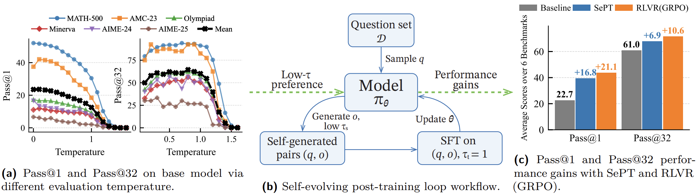
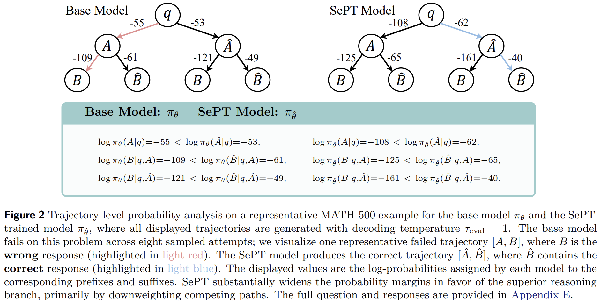

<table>
  <tr>
    <td style="width: 95%;"></td>
  </tr>
  <tr>
    <td colspan="2" style="text-align: center;">
      
    </td>
  </tr>
</table>


# SePT

Code for [A Model Can Help Itself: Reward-Free Self-Training for LLM Reasoning](SePT.pdf).

SePT (Self-Evolving Post-Training) is a self-help, reward-free method that improves LLM reasoning by finetuning the model on its own generated responses.

> [!NOTE]
> This codebase is not fully optimized (e.g. unnecessary loggings and computation; not tested on the newest version of verl and transformers), and the LoRA implementation has not been fully checked for correctness yet; feel free to raise any issues you encountered.

## Setup

```sh
git clone https://github.com/ElementQi/SePT.git
cd SePT/sept

conda create -n sept python=3.10
conda activate sept

# to keep pkg_resources alive
pip install "setuptools<81"

# some machines need this
# conda install -c conda-forge pyzmq
pip install -r requirements.txt
pip install flash_attn==2.7.4.post1 --no-build-isolation  # choose a suitable version for your own machine
pip install -e . --no-dependencies
```

> [!NOTE]
> Installation process could be different from various machines and system, but the installation script above is tested on our A800 and 3090 clusters.

If you have any issues when installing the packages, you can refer to the [installation tutorial from verl](https://verl.readthedocs.io/en/latest/start/install.html) and check [our runnable conda environment](sept/sept_envs/environment.yaml).

## Reproduce Experiments

Before running the scripts below, please ensure you are in the project root directory (`SePT/sept`).

> [!WARNING]
> **Configuration is required before running!**
> You MUST modify the scripts inside the `examples/` directory to fit your environment. Key parameters to change include:
> - Model Path: Update the path to your base model.
> - Logger: The default logger is `swanlab`. If you prefer `wandb` or just `console`, modify `trainer.logger=['console','swanlab']`.
> - Validation Workload: For faster iteration, you can remove some benchmark files from `VAL_FILE_LIST` in scripts such as `examples/sept_1e7_dsr.sh`.
> - Validation Sampling: `actor_rollout_ref.rollout.val_kwargs.n=32` is fairly expensive for pass@k evaluation. For smoke tests, you can lower it to `4` or less. Likewise, in the sweep scripts, you can reduce `N=32`.
> - Shared Memory: The example scripts default to `model.use_shm=False`. Only enable shared memory if you have verified it works well on your machine.
> - Other Hyperparameters: Like rollout number, batch size...


```sh
conda activate sept

# for SePT training
bash examples/sept_1e7_dsr.sh

# for GRPO training
bash examples/grpo_5e7_dsr.sh

# for EM-FT training
bash examples/em_1e7_dsr.sh

# for SePT (Offline) training
bash examples/generate_solutions.sh
bash examples/offline_train.sh
```


### Validation on specific checkpoints

For evaluation, we re-write the evaluation code for `_validate` function inside the Trainer. And if you want to evaluate a specific checkpoint or base model, try to use `examples/trained_model_sweep.sh` and `examples/base_model_sweep.sh`.

If you want to transform the training checkpoints via verl, you should follow the instructions from [verl official tutorial for model converting](https://verl.readthedocs.io/en/latest/advance/checkpoint.html#convert-fsdp-and-megatron-checkpoints-to-huggingface-format-model). The model merge script is located in [here](https://github.com/volcengine/verl/blob/main/scripts/legacy_model_merger.py).

## Dataset

The datasets are located in `data` folder. There are two training sets DSR (DeepScaleR) and OTM (Openthoughts Math-only). And there are 6 benchmark files inside its `benchmarks` folder.

## What we mainly modified

### Training logic

- `recipe/sept/sept_trainer`: SePT training logic

- `recipe/sept/dp_actor`: Cross entropy calculating


### Validation logic

- `verl/trainer/ppo/metric_utils.py`: Added a pass@k calculation logic during validation.

- `verl/trainer/ppo/ray_trainer.py`: Modified the validation logic by selecting 16 different question-response pairs for different validation dataset in `_validate` function.

### Verifier

`sept/verl/utils/reward_score/__init__.py`

## Source Acknowledgement

This repository is built based on [VERL](https://github.com/volcengine/verl) at commit hash `38d9a88170786a45cb189a08290c4651e6d6f671`. 


For verifier, we used the verifier from [The Entropy Mechanism of Reinforcement Learning for Large Language Model Reasoning.](https://arxiv.org/pdf/2505.22617), which uses [HuggingFace Math-Verify](https://github.com/huggingface/Math-Verify). The source code could be found in [VERL entropy recipe](https://github.com/volcengine/verl/tree/main/recipe/entropy/reward_score/entropy_math).


